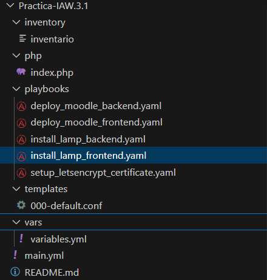
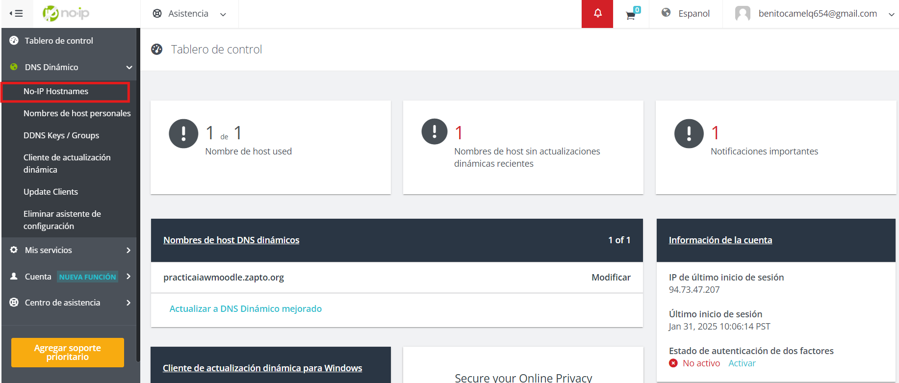
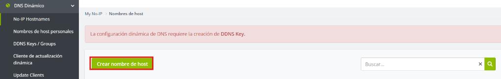
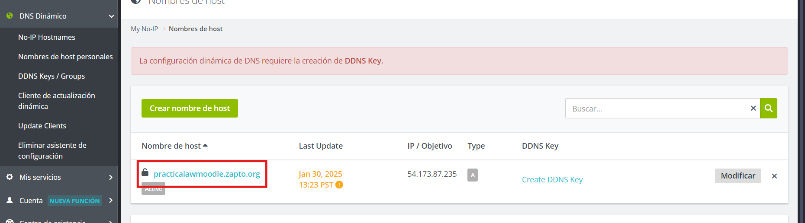
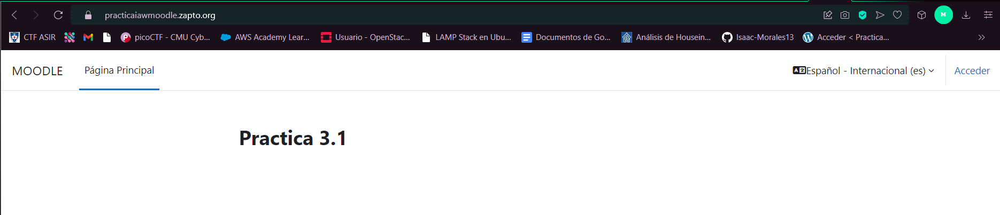
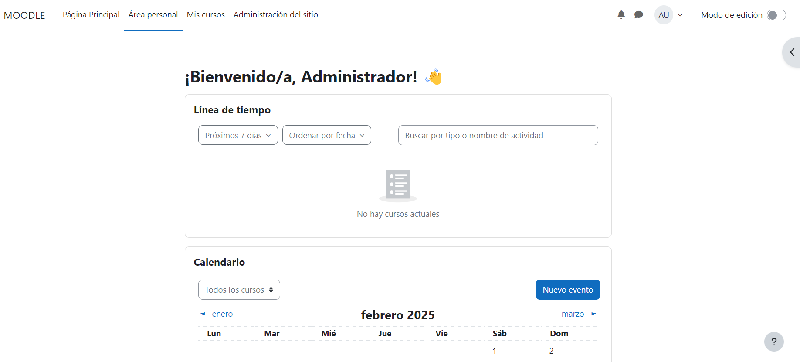

# Practica-IAW.3.1
Repositorio para la práctica 3.1

En esta práctica vamos a realizar la implantación de la aplicación web Moodle en dos instancias EC2 de Amazon Web Services (AWS) haciendo uso de playbooks de Ansible. En una de las instancias deberemos instalar Apache HTTP Server y los módulos necesarios de PHP y en la otra máquina deberá instalar MySQL Server.

> [!IMPORTANT]  
> Antes de empezar a configurar los archivos vamos a crear la siguiente estructura de archivos y directorios
>

## Creación de un nombre de dominio 
Lo primero que vamos a hacer es crear un nombre de dominio para nuestro servidor. Vamos a usar el proveedor de nombres de dominio gratuito `No-Ip`

Nos registramos en la pagina y nos iremos a la sección no ip hostnames


Una vez dentro le damos a crear nombre de host


Y se nos abrira un menú para crear el nombre de host, en mi caso le he cambiado el nombre y dominio y he añadido la dirección ip del frontal


Hecho esto, pasaremos a configurar playbook que reunirá todos 

> [!IMPORTANT]  
> Antes de seguir vamos a asegurarnos que tenemos el archivo de variables configurado de esta manera. Este archivo sera importado por los diferentes playbooks
> ```bash
> Variables para el certificado de LetsEncrypt
>letsencrypt:
>  email: "admin@gmail.com"
>  domain: "practicaiawmoodle.zapto.org"
>
> Variables para Moodle
>moodle:
>  version: "4.3.1"
>  lang: "es"
>  wwwroot: "https://practicaiawmoodle.zapto.org"
>  dataroot: "/var/moodledata"
>db:
>    type: "mysqli"
>    host: "172.31.33.225"
>    name: "Moodle"
>    user: "admin"
>    pass: "Usuario?"
>  fullname: "Practica 3.1"
>  shortname: "MOODLE"
>  summary: "Esta es mi web de Moodle"
>  admin:
>    user: "admin"
>    pass: "Usuario0?"
>    email: "demo@demo.es"
>
> Direcciones IP
>ips:
>  frontend_private: "172.31.47.161"
>  backend_private: "172.31.33.225"
>
> Rutas
>routes:
>  apache_ini: "/etc/php/8.3/apache2/php.ini"
>  cli_ini: "/etc/php/8.3/cli/php.ini"
>  config_php: "/var/www/html/config.php"
>  moodle_directory: "/var/www/html"
>```

## Configuración del playbook main.yml
Este playbook recopila todos en uno solo para desde un solo playbook ejecutar todos. Main.yml deberá tener este codigo

```
---
- import_playbook: playbooks/install_lamp_frontend.yaml
- import_playbook: playbooks/install_lamp_backend.yaml
- import_playbook: playbooks/setup_letsencrypt_certificate.yaml
- import_playbook: playbooks/deploy_moodle_backend.yaml
- import_playbook: playbooks/deploy_moodle_frontend.yaml
```

Vamos a explicar los playbooks en el orden de que serán ejecutados

### Configuración del playbook install_lamp_frontend.yaml

```bash
---
- name: Configurar servidor web Apache y PHP
  hosts: frontend
  become: yes
  tasks:
    - name: Actualizar repositorios
      apt:
        update_cache: yes

    - name: Actualizar paquetes
      apt:
        upgrade: dist

    - name: Instalar Apache
      apt:
        name: apache2
        state: present

    - name: Instalar unzip
      apt:
        name: unzip
        state: present

    - name: Habilitar módulo rewrite de Apache
      command: a2enmod rewrite

    - name: Copiar archivo de configuración de Apache
      copy:
        src: ../templates/000-default.conf
        dest: /etc/apache2/sites-available/000-default.conf

    - name: Instalar PHP y módulos necesarios
      apt:
        name:
          - php
          - php-mysql
          - libapache2-mod-php
          - php-xml
          - php-mbstring
          - php-curl
          - php-zip
          - php-gd
          - php-intl
          - php-soap
        state: present

    - name: Reiniciar servicio de Apache
      service:
        name: apache2
        state: restarted

    - name: Copiar script de prueba de PHP
      copy:
        src: ../php/index.php
        dest: /var/www/html/index.php

    - name: Cambiar propietario y grupo del archivo index.php
      file:
        path: /var/www/html/index.php
        owner: www-data
        group: www-data
        mode: "0644"
```

Este playbook se ejecutará en el frontal.Todos los comandos se ejecutaran como super usuario. Empezamos actualizando los repositorios y los paquetes, luego intalando apache y unzip

Luego habilitamos el modulo rewrite, copiamos nuestra plantilla de Apache a la configuración de la maquina

Instalamos PHP y modulos necesarios, reiniciamos Apache

Por ultimo copiamos el script de prueba y cambiamos el propietario y el grupo del archivo index.php

### Configuración del playbook install_lamp_backend.yaml

```bash
---
- name: Configuración de MySQL
  hosts: backend
  become: yes
  vars_files:
    - ../vars/variables.yml 

  tasks:
    - name: Actualizar los repositorios
      apt:
        update_cache: yes

    - name: Actualizar los paquetes instalados
      apt:
        upgrade: dist
        autoremove: yes

    - name: Instalar MySQL Server
      apt:
        name: mysql-server
        state: present

    - name: Instalamos el módulo de pymysql
      apt:
        name: python3-pymysql
        state: present

    - name: Configurar el archivo mysqld.cnf
      lineinfile:
        path: /etc/mysql/mysql.conf.d/mysqld.cnf
        regexp: "^bind-address\\s*=\\s*.*"
        line: "bind-address = {{ ips.backend_private }}"
        state: present
        
    - name: Reiniciar el servicio de MySQL
      service:
        name: mysql
        state: restarted

```
Este playbook se ejecutará en el backend.Todos los comandos se ejecutaran como super usuario. Empezamos actualizando los repositorios y los paquetes

Luego instalando mysql server y el módulo de pymsql

Finalmente configuramos el archivo mysqld.cnf con nuestra ip y reiniciamos mysql

### Configuración del playbook setup_letsencrypt_certificate.yaml


```
---
- name: Instalar y configurar Certbot para Let's Encrypt
  hosts: frontend  
  become: yes  # Ejecutar con privilegios de superusuario
  vars_files:
    - ../vars/variables.yml  # Archivo YAML con las variables necesarias

  tasks:
    - name: Actualizar snapd
      ansible.builtin.snap:
        name: core
        state: present

    - name: Eliminar instalaciones previas de Certbot (si existen)
      ansible.builtin.apt:
        name: certbot
        state: absent

    - name: Instalar Certbot usando snap
      ansible.builtin.snap:
        name: certbot
        classic: yes  

    - name: Crear enlace simbólico para Certbot
      ansible.builtin.file:
        src: /snap/bin/certbot
        dest: /usr/bin/certbot
        state: link
        force: yes  

    - name: Solicitar certificado de Let's Encrypt
      ansible.builtin.command:
        cmd: |
          certbot --apache -m {{ letsencrypt.email }} --agree-tos --no-eff-email -d {{ letsencrypt.domain }} --non-interactive
```
Este playbook se ejecutará en el frontal.Todos los comandos se ejecutaran como super usuario. Empezamos actualizando snap

Eliminamos instalaciones previas de Cerbot y lo instalamos usando snap

Creamos el enlace simbolico para Certbot

Finalmente solicitamos el certificado de Lets Encrypt


### Configuración del playbook deploy_moodle_backend.yaml

```
---
- name: Configuración de base de datos para Moodle
  hosts: backend
  become: yes  # Usamos privilegios de superusuario para realizar cambios
  vars_files:
    - ../vars/variables.yml  # Archivo YAML con las variables necesarias

  tasks:
    - name: Eliminar la base de datos si existe
      mysql_db:
        name: "{{ moodle.db.name }}"
        state: absent
        login_unix_socket: /var/run/mysqld/mysqld.sock

    - name: Crear la base de datos
      mysql_db:
        name: "{{ moodle.db.name }}"
        state: present
        login_unix_socket: /var/run/mysqld/mysqld.sock

    - name: Eliminar el usuario si existe
      mysql_user:
        name: "{{ moodle.db.user }}"
        host: "{{ ips.frontend_private }}"
        state: absent
        login_unix_socket: /var/run/mysqld/mysqld.sock

    - name: Crear el usuario para Moodle
      mysql_user:
        name: "{{ moodle.db.user }}"
        host: "{{ ips.frontend_private }}"
        password: "{{ moodle.db.pass }}"
        priv: "{{ moodle.db.name }}.*:ALL"
        state: present
        login_unix_socket: /var/run/mysqld/mysqld.sock

    - name: Actualizar privilegios
      mysql_user:
        name: "{{ moodle.db.user }}"
        host: "{{ ips.frontend_private }}"
        check_implicit_admin: yes
        login_unix_socket: /var/run/mysqld/mysqld.sock
```
Este playbook se ejecutará en el backend.Todos los comandos se ejecutaran como super usuario. Empezamos eliminando la base de datos si existe y la creamos 

Eliminamos el usuario si existe y creamos el usuario para Moodle. Finamente actualizamos sus privilegios

### Configuración del playbook deploy_moodle_frontend.yaml

```
---
# Playbook para la instalación y configuración de Moodle
- name: Instalar y configurar Moodle
  hosts: frontend
  become: true
  vars_files:
    - ../vars/variables.yml  # Cargar variables desde un archivo externo

  tasks:
    - name: Habilitar módulo rewrite en Apache
      ansible.builtin.command: a2enmod rewrite

    - name: Eliminar instalaciones previas de Moodle
      ansible.builtin.file:
        path: "{{ item }}"
        state: absent
      loop:
        - "{{ routes.moodle_directory }}"
        - "{{ moodle.dataroot }}"
        - "/tmp/{{ moodle.version }}.zip"

    - name: Crear directorio de Moodle
      ansible.builtin.file:
        path: "{{ routes.moodle_directory }}"
        state: directory
        mode: '0755'

    - name: Descargar archivo zip de Moodle
      ansible.builtin.get_url:
        url: https://github.com/moodle/moodle/archive/refs/tags/v4.3.1.zip
        dest: "/tmp/{{ moodle.version }}.zip"

    - name: Descomprimir Moodle
      ansible.builtin.unarchive:
        src: "/tmp/{{ moodle.version }}.zip"
        dest: "/tmp"
        remote_src: yes

    - name: Copiar archivos de Moodle al directorio web
      ansible.builtin.copy:
        src: "/tmp/moodle-{{ moodle.version }}/"
        dest: "{{ routes.moodle_directory }}"
        remote_src: yes

    - name: Cambiar propietario y permisos del directorio de Moodle
      ansible.builtin.file:
        path: "{{ routes.moodle_directory }}"
        owner: "www-data"
        group: "www-data"
        mode: '0755'
        recurse: yes

    - name: Crear directorio para los datos de Moodle
      ansible.builtin.file:
        path: "{{ moodle.dataroot }}"
        state: directory
        owner: "www-data"
        group: "www-data"
        mode: '0777'

    - name: Modificar configuración de PHP
      ansible.builtin.lineinfile:
        path: "{{ item }}"
        regexp: "^;max_input_vars = 1000"
        line: "max_input_vars = 5000"
        state: present
      loop:
        - "{{ routes.apache_ini }}"
        - "{{ routes.cli_ini }}"

    - name: Instalar Moodle desde CLI
      ansible.builtin.shell: |
        php {{ routes.moodle_directory }}/admin/cli/install.php \
          --lang={{ moodle.lang }} \
          --wwwroot={{ moodle.wwwroot }} \
          --dataroot={{ moodle.dataroot }} \
          --dbtype={{ moodle.db.type }} \
          --dbhost={{ moodle.db.host }} \
          --dbname={{ moodle.db.name }} \
          --dbuser={{ moodle.db.user }} \
          --dbpass={{ moodle.db.pass }} \
          --fullname="{{ moodle.fullname }}" \
          --shortname="{{ moodle.shortname }}" \
          --summary="{{ moodle.summary }}" \
          --adminuser={{ moodle.admin.user }} \
          --adminpass={{ moodle.admin.pass }} \
          --adminemail={{ moodle.admin.email }} \
          --non-interactive \
          --agree-license
      become: true

    - name: Cambiar propietario de los archivos de Moodle
      ansible.builtin.file:
        path: "{{ routes.moodle_directory }}"
        owner: "www-data"
        group: "www-data"
        recurse: yes

    - name: Reiniciar Apache
      ansible.builtin.service:
        name: apache2
        state: restarted
```
Este playbook se ejecutará en el frontal.Todos los comandos se ejecutaran como super usuario. Empezamos habilitando el modulo rewrite en Apache 

Eliminamos instalaciones previas de Moodle. Creamos el directorio de Moodle

Descargamos el archivo zip de Moodle. Lo descomprimimos

Copiamos los archivos de Moodle al directorio web y le cambiamos propietario y permisos

Creamos directorio para los datos de Moodle

Modificamos configuración de PHP e instalamos Moodle desde el cli

Finalmente cambiamos el propietario de los archivos de Moodle y reiniciamos Apache

### Comprobaciones

Ahora si ponemos el nombre del dominio en el navegador nos llevará a nuestro Moodle



Iniciamos sesión y una vez iniciada veremos algo parecido a esto


